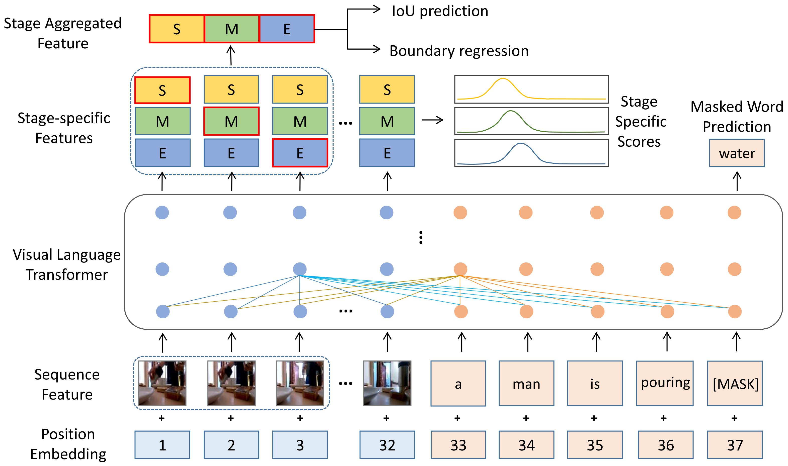

# MSAT

This is the code for the paper "Multi-stage Aggregated Transformer Network for Temporal Language Localization in Videos". We appreciate the contribution of [2D-TAN](https://github.com/microsoft/2D-TAN).

## Framework


## Prerequisites
- python 3
- pytorch 1.6.0
- torchvision 0.7.0
- torchtext 0.7.0
- easydict
- terminaltables


## Quick Start

Please download the visual features from [box drive](https://rochester.box.com/s/8znalh6y5e82oml2lr7to8s6ntab6mav) and save it to the `data/` folder. 


#### Training
Use the following commands for training:
```
# For ActivityNet Captions
python moment_localization/train.py --cfg experiments/activitynet/MSAT-64.yaml --verbose

# For TACoS
python moment_localization/train.py --cfg experiments/tacos/MSAT-128 --verbose
```

#### Testing
Our trained model are provided in [Baidu Yun](https://pan.baidu.com/s/1l9O7Csg479kmQB8hsqYM8w)(access code:rc2m). Please download them to the `checkpoints` folder.

Then, run the following commands for evaluation: 
```
# For ActivityNet Captions
python moment_localization/test.py --cfg experiments/activitynet/MSAT-64.yaml --verbose --split test

# For TACoS
python moment_localization/test.py --cfg experiments/tacos/MSAT-128 --verbose --split test
```

## Citation
If any part of our paper and code is helpful to your work, please generously cite with:
```
@inproceedings{zhang2021multi,
  title={Multi-Stage Aggregated Transformer Network for Temporal Language Localization in Videos},
  author={Zhang, Mingxing and Yang, Yang and Chen, Xinghan and Ji, Yanli and Xu, Xing and Li, Jingjing and Shen, Heng Tao},
  booktitle={Proceedings of the IEEE/CVF Conference on Computer Vision and Pattern Recognition},
  pages={12669--12678},
  year={2021}
}
```
